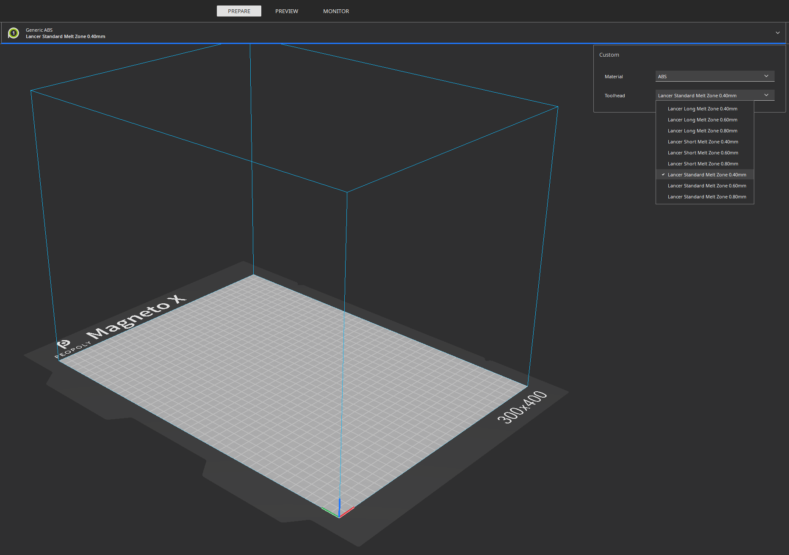

# Cura-Profiles
## Peopoly MagnetoX Cura Configuration

## ⚠️ 🚧 THESE PROFILES ARE A WORK-IN-PROGRESS 🚧

⚠️ Printer may not have proper constraints

⚠️ The Toolhead dimensions may not be correct for 'Print One at a time' (Print-by-object) printing. Use at your own risk.

## How to Use
1.) Download/clone the project

2.) On Windows, browse to: %APPDATA% (You can type into File Explorer or the Windows Run command)

3.) Paste the cura folder over the top of the cura folder that is already there.

4.) Open Cura and add your Magneto X 

5.) 🛑 ℹ️ Check the start GCODE and verify it will work for your setup

## Known Issues
+ ASA profiles seem to be broken. I'm not sure why. The same seems to occur with Voron ASA profiles.

Pull requests are welcome!
