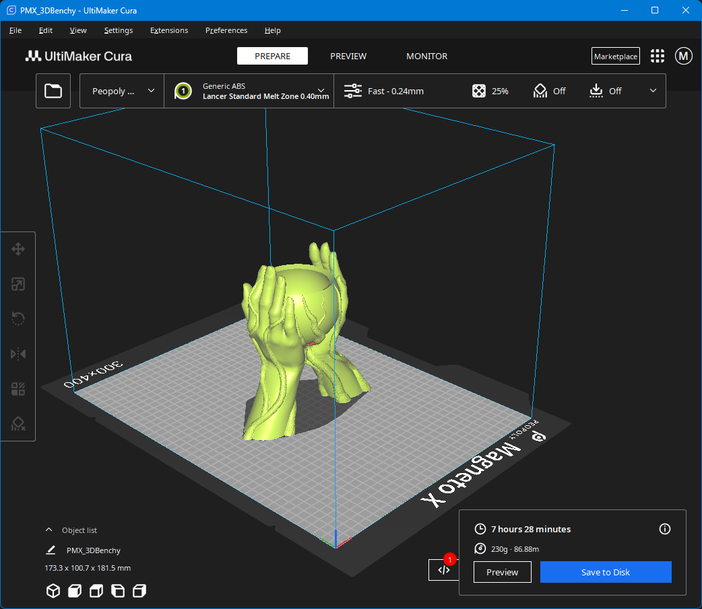

# Cura-Profiles
## Peopoly MagnetoX Cura Configuration

## ⚠️ 🚧 THESE PROFILES ARE A WORK-IN-PROGRESS 🚧

⚠️ Printer may not have proper constraints

⚠️ The Toolhead dimensions may not be correct for 'Print One at a time' (Print-by-object) printing. Use at your own risk.

## How to Use
1.) Download/clone the project

2.) On Windows, browse to: %APPDATA% (You can type into File Explorer or the Windows Run command).

On Linux distros you will likely be able to use `~/.local/share/cura`

3.) Paste the cura folder over the top of the cura folder that is already there.

4.) Open Cura and add your Magneto X 

5.) 🛑 ℹ️ Check the start GCODE and verify it will work for your setup

### Recommended Extensions:
+ [Klipper Settings](https://marketplace.ultimaker.com/app/cura/plugins/JJGraphiX/KlipperSettingsPlugin)
+ [Moonraker Connection](https://marketplace.ultimaker.com/app/cura/plugins/emtrax/MoonrakerConnection)
+ Modify Cura to [support thumbnails in GCODE](https://docs.fluidd.xyz/features/thumbnails#cura-with-post-processing-script)

## Known Issues
+ Utilizes volumetric speed calculations; they may not be quite accurate at this point in time and generally seem to be higher than Peopoly Orca Slicer default profiles
+ Many Peopoly-specific filament settings have not been copied over
+ If using KAMP, start GCODE will need to be changed to EXTRUDER_TEMP and BED_TEMP
+ ASA profiles seem to be broken. I'm not sure why. The same seems to occur with Voron ASA profiles on Voron printers.

Pull requests are welcome!

## Sources for Data:
+ Peopoly Pull Request that was cancelled: https://github.com/SoftFever/OrcaSlicer/pull/5435/files
+ Voron pull request for Cura here: https://github.com/Ultimaker/Cura/pull/20023 to utilize volumetric speeds
